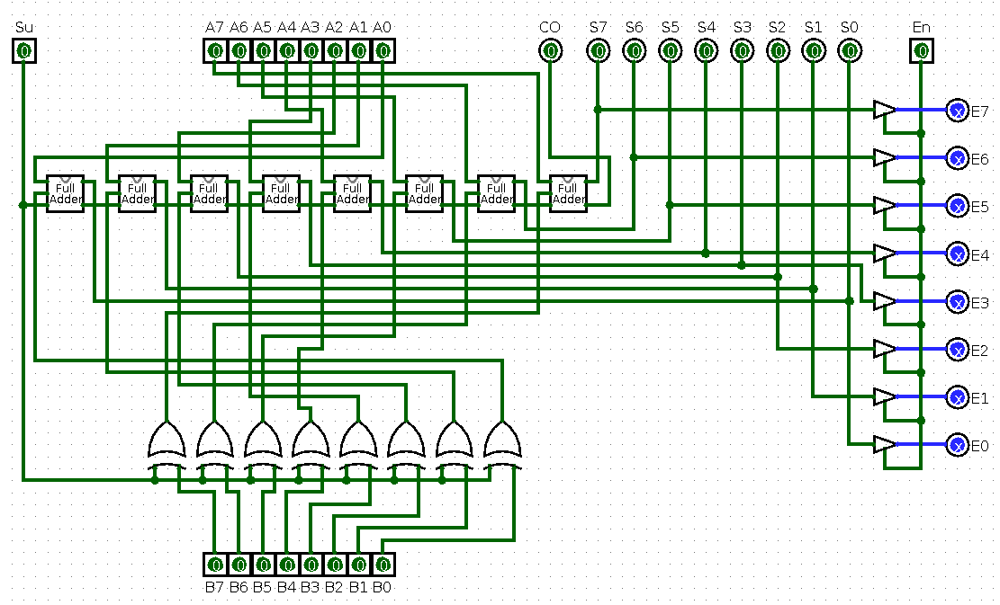

# Basic 8-bits computer simulation

A basic 8-bits computer created with [LogiSim](http://www.cburch.com/logisim/pt/index.html) digital circuit simulator.

- [Basic 8-bits computer simulation](#basic-8-bits-computer-simulation)
  - [Project objective](#project-objective)
  - [Acknowledgments](#acknowledgments)
  - [The current processor version](#the-current-processor-version)
  - [The BUS](#the-bus)
  - [The full adder](#the-full-adder)
  - [The 8-bits Arithmetic and Logic Unit (ALU)](#the-8-bits-arithmetic-and-logic-unit-alu)
  - [The 8-bits registers](#the-8-bits-registers)

## Project objective

This project objective is to build a basic 8-bits computer with a functional 8-bits processor using a digital circuit simulator (LogiSim).

For future versions I will expand the circuits modules functionalities creating a more complex processor, but for now, I'm trying to keep the circuits as simple as possible.

## Acknowledgments

`Ben Eater` and his [YouTube channel](https://www.youtube.com/user/eaterbc) with great videos explaining about a processor architecture.

## The current processor version

This is the current processor circuit version. It's not complete yet, but it's quite cool, isn't?.

Is there anything missing? Yes, I know, the program counter (PC), instructions decoder, the RAM memory, etc. I'll put these modules into the processor in the next versions.

## The BUS

The BUS is used to connect all processor modules allowing the components to communicate with each other.

Normally there is more than 1 bus in a processor, like the data BUS, address BUS, control BUS, etc. For the first processor version I'm using only 2 BUS, one for data e one for control.

The data bus:

## The full adder

This is the circuit responsible for sum two numbers. It's a important piece for the ALU.

## The 8-bits Arithmetic and Logic Unit (ALU)

The ALU executes the arithmetic (sum, subtract, multiplication, division) and logic (and, or, xor, not, comparison) operations inside the processor. In my processor, the ALU is directly connected to the registers A and B to use them as source to perform the operations.

For this first processor version, I will only implement the ALU sum and subtraction operations, reserving the other operations for a future version.

## The 8-bits registers

A register is a processor piece that is responsible for storing information. In our case, the 8-bits register will store an 8-bits number.

This processor will use 5 registers: 
1) Program counter register (PC)
2) Register A connected to the ALU
3) Register B connected to the ALU
4) Instruction register
5) Memory address register

This is the internal 8-bits register circuit:

